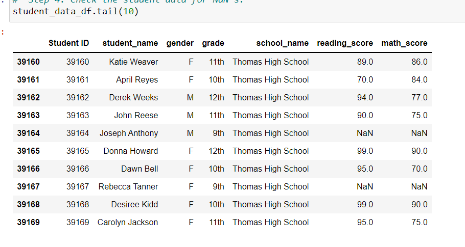
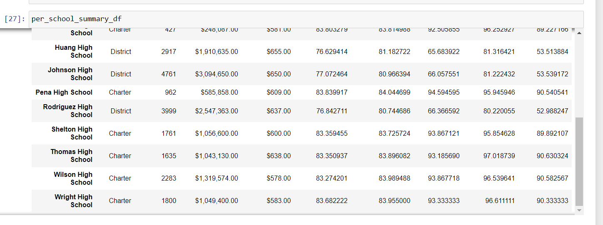
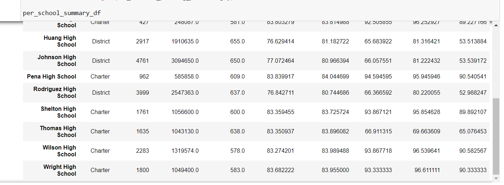
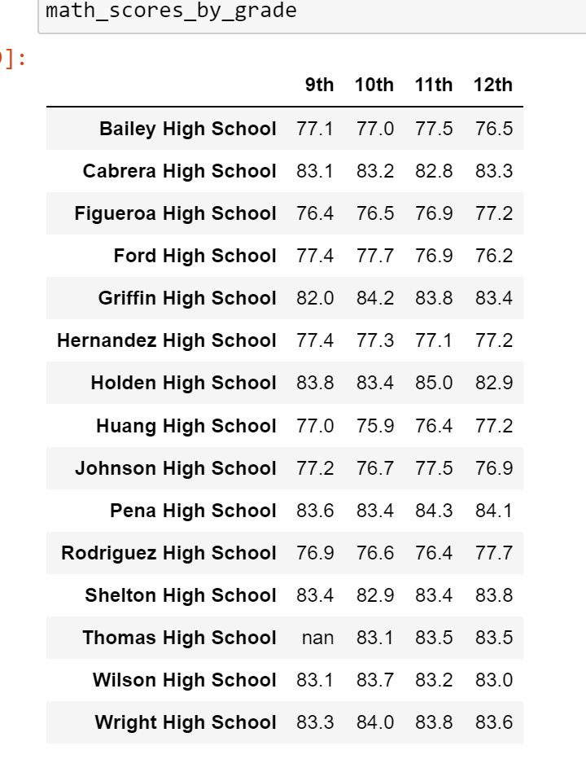
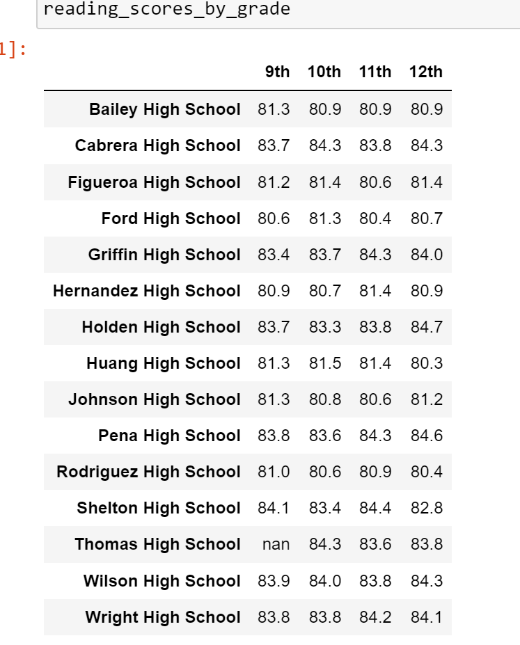
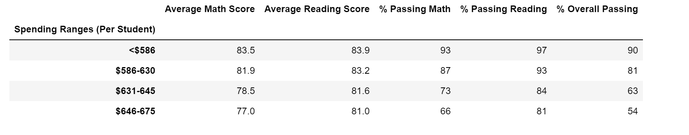
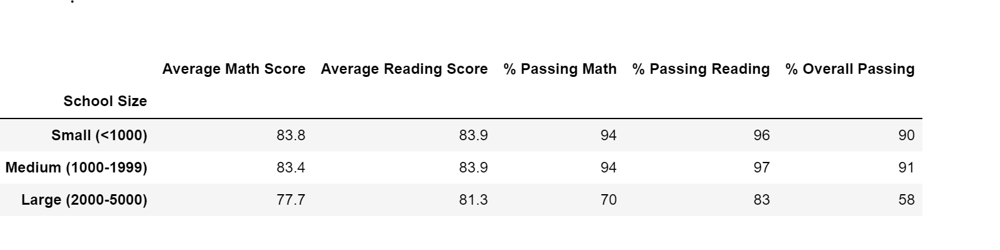
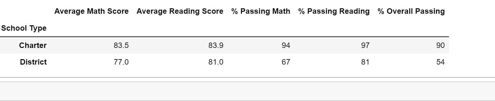

# School_District_Analysis
Python, Jupyter Notebook, Pandas Library, CSV Files

## Project Overview

A school district employee is requesting the following analysis of the school district data. The school board want to use the information to make a decision about the budget for the upcoming school year.  Such as, how much money should be allocated to and spent on each school. The analysis will be represented in a table format.

1. The school district summary, a snapshot of the district's key metrics: 
    - Total number of schools
    - Total number of students 
    - Total budget 
    - Average reading score 
    - Average math score 
    - Percentage of students passing reading 
    - Percentage of students passing math
    - Overall passing percentage
    
2. Per school summary.
    - Type of school
    - Total students per school
    - Total budget per school
    - Total budget per student for each school
    - Average math score for each school
    - Average reading score for each school 
    - Percentage of students passing math for each school
    - Percentage of students passing reading for each school 
    - Overall passing percentage for each school
    
3. Top 5 and bottom 5 performing schools, based on the overall percentage of passing students. 

4. Average math and reading scores by grade level.
    - The average math score received by students in each grade level at each school
    - The average reading score received by students in each grade level at each school
 
5. School performance based on the budget per student. This data organized by spending ranges for the schools. This information is used to look at how does school spending per student affect the school's average scores and passing percentages?   

    - Average Math Score
    - Average Reading Score
    - Average % Passing Math
    - Average % Passing Reading
    - Average % Overall Passing
 
6. School performance based on the school size. This analysis uses the same grouping of averages and percentages as above. 

7. School performance based on the type of school: district and charter. This analysis uses the same grouping of averages and percentages as above

## Resources

- Software: Python 3.7, Juypter Notebook, conda version 4.8.3, Pandas Library, CSV Files
- Data Source: school_data.csv, student_data.csv

## Challenge Overview

The students_complete.csv file shows evidence of academic dishonesty; specifically, reading and math grades for Thomas High School ninth graders appear to have been altered. The task is to replace the math and reading scores for Thomas High School with NaNs while keeping the rest of the data intact. After the math and reading scores are replaced, repeat the school district analysis and write up a report to describe how these changes affected the overall analysis.

## Results

The new student data records after reading and math scores for the ninth grade at Thomas High School have been replaced with NaNs.

Four metrics change in the updated school district analysis after reading and math scores for the ninth grade at Thomas High School have been replaced with NaNs.

   - New total student count (less 9th graders at Thomas High School)
   - New Passing math %, using new student count
   - New Passing reading %, using new student count
   - New Overall passing percentate, using new student count
       
Based on the above changes, answers to the following questions:
- How is the district summary affected? 
    - Image before NaN change
    
      

    - Image after NaN change
  
     
     
    - The scores changes were minimal                
       - Avg math score was decreased by .1 from 79.0 to 78.9
       - Avg reading score 81.9 remained the same
       - % Passisng Math was decreased by .2% from 75.0 to 74.8
       - % Passing Readidng was decreased by .1% from 85.8 to 85.7
       - % Overall Passing was decreased by .3% from 65.2 to 64.9
        
- How is the school summary affected?   
   - Image before NaN change
   
      

   - Image after NaN change
     
     
   - The performance was lower.    
     - Avg math score was decreased by .06 from 83.41 to 83.35
     - Avg reading score was increased .05 by 83.84 to 83.89
     - % Passisng Math was decreased by .09% from 93.27 to 93.18
     - % Passing Readidng was decreased by .29% from 97.30 to 97.01
     - % Overall Passing was decreased by .31% from 90.94 to 90.63
    
- How does replacing the ninth graders’ math and reading scores affect Thomas High School’s performance relative to the other schools?

     - Image before NaN change
     
     

     - Image after NaN change

     
     
     - The scores were lower
       - average Math score decreased slightly .06 from 83.41 to 83.35
       - average reading score increased slightly by .05 from 83.84 to 83.89
       - % Passing Math decreased significantly 26.36% from 93.27 to 66.91
       - % Passing Reading decreased significantly by 27.64% from 97.30 to 69.66
       - % Overall Passing decreased significantly by 25.87% from 90.94 to 65.07
        
- How does replacing the ninth-grade scores affect the following:  

    - Math scores by grade: there was no change

      - Image before NaN change
      
        

      - Image after NaN change
    
       
       
    - Reading scores by grade: there was no change     

      - Image before NaN change
       

      - Image after NaN change
       
       
       
    - Scores by school spending: there was no change

      - Image before NaN change
      
       

      - Image after NaN change
   
       
    
    - Scores by school size: there was no change
    
      - Image before NaN change

       
     
      - Image after NaN change
  
       
       
    - Scores by school type: there was no change

      - Image before NaN change

       
   
      - Image after NaN change
    
        
    
## Summary

Four changes in the updated school district analysis after reading and math scores for the ninth grade at Thomas High School have been replaced with NaNs:

   - Avg math score was lowered by .1 
   - Avg reading score 81.9 remained the same
   - % Passisng Math was lowered by.2% 
   - % Passing Readidng was lowered by .1% 
   - % Overall Passing was lowered by .3% 

## Final Statement

The number of students affected at Thomas High School was very small compare to the whole district student population. Therefore, it has minimal to no affect to the school district analysis.
