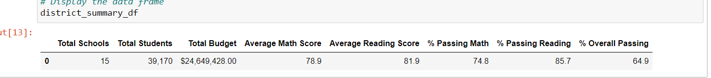

# School_District_Analysis
Python,Jupyter Notebook

## Project Overview

A School board is making a decisions about the budget for the upcoming school year. Such as,

A school district employee is requesting the following analysis of the school district data. The analysis will be represented in a table format.
 
1. The school district summary, a snapshot of the district's key metrics: 
    - Total number of schools
    - Total number of students 
    - Total budget 
    - Average reading score 
    - Average math score 
    - Percentage of students passing reading 
    - Percentage of students passing math
    - Overall passing percentage
    
2. Per school summary, a tables presenting each of the following metrics:
    - Type of school
    - Total students per school
    - Total budget per school
    - Total budget per student for each school
    - Average math score for each school
    - Average reading score for each school 
    - Percentage of students passing math for each school
    - Percentage of students passing reading for each school 
    - Overall passing percentage for each school
    
3. Top 5 and bottom 5 performing schools, based on the overall percentage of passing students. 

4. Average math and reading scores by grade level.
    - The average math score received by students in each grade level at each school
    - The average reading score received by students in each grade level at each school
 
5. School performance based on the budget per student. This data organized by spending ranges for the schools. This information look at how does school spending per student affect the school's average scores and passing percentages?   

    - Average Math Score
    - Average Reading Score
    - Average % Passing Math
    - Average % Passing Reading
    - Average % Overall Passing
 
6. School performance based on the school size. This analysis uses the same grouping of averages and percentages as above. 

7. School performance based on the type of school: district and charter. This analysis uses the same grouping of averages and percentages as above

## Resources

- Software: Python 3.7, Juypter Notebook, conda version 4.8.3, Pandas Library, CSV Files
- Data Source: school_data.csv, student_data.csv

## Challenge Overview

The students_complete.csv file shows evidence of academic dishonesty; specifically, reading and math grades for Thomas High School ninth graders appear to have been altered. The task is to replace the math and reading scores for Thomas High School with NaNs while keeping the rest of the data intact. After the math and reading scores are replaced, repeat the school district analysis and write up a report to describe how these changes affected the overall analysis.

## Results

There were four changes in the updated school district analysis after reading and math scores for the ninth grade at Thomas High School have been replaced with NaNs: 
    - New total student count (less 9th graders at Thomas High School)
    - New Passing math %, using new student count
    - New Passing reading %, using new student count
    - New Overall passing percentate, using new student count
    
   /Student_data_NaN.png)  
   
Based on the above changes, below are 
- How is the district summary affected? 
  
 
     
     
     The affect was mininimal               
    - Avg math score lower from 79.0 to 78.9
    - Avg reading score 81.9 same
    - % Passisng Math lower from 75.0 to 74.8
    - % Passing Readidng lower from 85.8 to 85.7
    - % Overall Passing lower from 65.2 to 64.9
        
- How is the school summary affected?  There were no change.    

     

- How does replacing the ninth graders’ math and reading scores affect Thomas High School’s performance relative to the other schools?

     
 
    - % Passing Math significantly lower from 93.2 to 66.9
    - % Passing Reading significantly lower from , 97.3 to 69.6
    - % Overall Passing significantly decreased from 90.9 to 65.0
    - average Math score increased slightly from 83.41 to 83.35
    - average reading score increased slightly from 83.84 to 83.89
        
- How does replacing the ninth-grade scores affect the following:  None were affected

    - Math and reading scores by grade: none  
    
       
       
       
       
    - Scores by school spending: none
       
    
    - Scores by school size: none
  
       
    - Scores by school type: none    
    
        
    
## Summary

Four changes in the updated school district analysis after reading and math scores for the ninth grade at Thomas High School have been replaced with NaNs:
    - New total student count (less 9th graders at Thomas High School)
    - New Passing math %, using new student count
    - New Passing reading %, using new student count
    - New Overall passing percentate, using new student count

## Final Statement

- Since the number of students affected was so small compare to the whole student population. Therefore, it has minimal to no affect to the original analysis.
